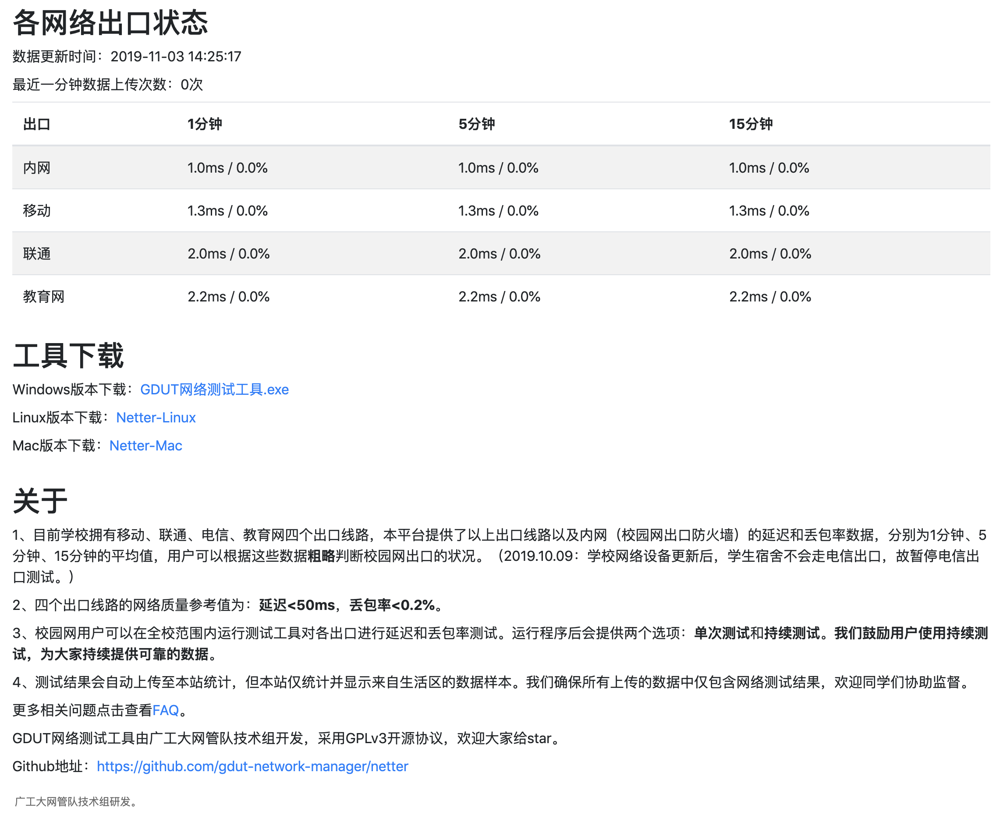

# GDUT_network_tester_server

GDUT网络测试工具服务端

## 截图

## 部署

业务逻辑处理代码都在`main.py`里面。`mod_`前缀的为额外的功能模块。`mod_drcom_manager.py`接入了drcom用户管理系统，用于恶意攻击的查水表。`mod_weixin.py`接入了微信企业号，可以发送微信通知。

需要修改`mod_drcom_manager.py`里面的账号密码和`mod_weixin.py`的`corpid`和`corpsecret`。如果不需要这两个功能，可以把`main.py`相关的所有代码删掉，不影响功能。
